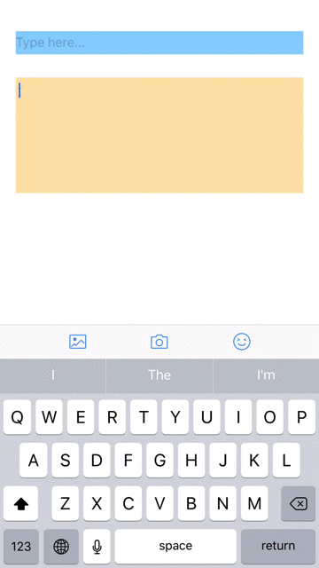

# WCEmotionKeyboard
A customized keyboard using your own emoji icons. The project is just a simple demo and modify it on your demand.




## Usage
```objective-c
<your textField/textView>.inputView = [WCEmotionKeyboard sharedInstance];
```

## Feautres
1. Pagable scrolling pages
2. A delete key for deleting text and emoji
3. UIPageControl for indicating current page
4. A magnifier shows more bigger emoji
5. Sound for hitting key

## Requirements
1. ARC
2. iOS 7+

## Author

wesley_chen, wesley4chen@gmail.com

## License

WCEmotionKeyboard is available under the MIT license. See the LICENSE file for more info.

